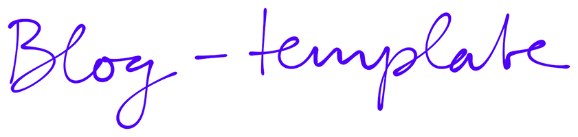

  
  

# blog-template

The template I based my blog on.

# Deploy your own

With this template you can start blogging in minutes, just click the button below and your blog will be available online at `https://your-blog-name.vercel.app`.

After the deploy make sure you read the [Initial setup](#initial-setup) section to customize the metadata of your blog.

# Initial setup

Once you've deployed your blog on vercel, you need to do some basic setup.

In the file `blog.config.js` you need to change values of the OWNER and BLOG variables, here you can also link the socials you want to display in the footer.

Now you can start writing your posts, you can find them in the `articles` folder, delete the sample post and start writing your own.

To publish a post just **push** the changes to the main branch of your repository, Vercel will automatically deploy the new version of your blog with your new post.

## Customize the logo

To change the logo displayed in the header you need two png files, one for the light mode and one for the dark mode.

Put these files in the `public` folder and name them `logo-light.png` and `logo-dark.png` respectively.

If you think that your logo is good both for light and dark mode, you can put the same image in both files or alternatively you can go in the `Header` component and remove the logic that swaps the logo based on the theme.

To change the size of the logo you need to edit the `Header.module.scss` file. A little experience with css is required. A handy workaround is to simply resize the logo files.

## Customize the color palette

To customize the color palette of your blog you need to edit the `_globals.module.scss` file in the `styles` folder.

At the top of the file you will find a list of variables that you can change to customize the colors of your blog.

## Customize the font

To customize the font of your blog you need to make two steps:

- Add the fonts you want to use in the `public/fonts` folder
- Edit the `main.scss` file in the `styles` folder.

Alternatively you can use a font from Google Fonts, in that case you just need to edit the `main.scss` file in the `styles` folder.

In the `main.scss` you just need to change the `font-family` and the `src` properties of the `@font-face` rules.

Then to apply the fonts to all the elements of the blog you need to change the `font-family` property of the `body` rule.

If you want to use different fonts for the heading tags you can change the `font-family` property of the `h1`, `h2`, `h3`, `h4`, `h5`, `h6` rules.

For more customization the scss is there waiting for you.

## Nuts and bolts

### Menu bar

If you wish to customize the menu bar, you have to edit the pages variable in the `pages/_app.js` file.

### Homepage

The blog comes with a default homepage that displays the latest posts. If you want you can put this page (and move the scss file accordingly) in the `posts` folder and create a new homepage.

You can use the homepage.jsx file as a starting point.
